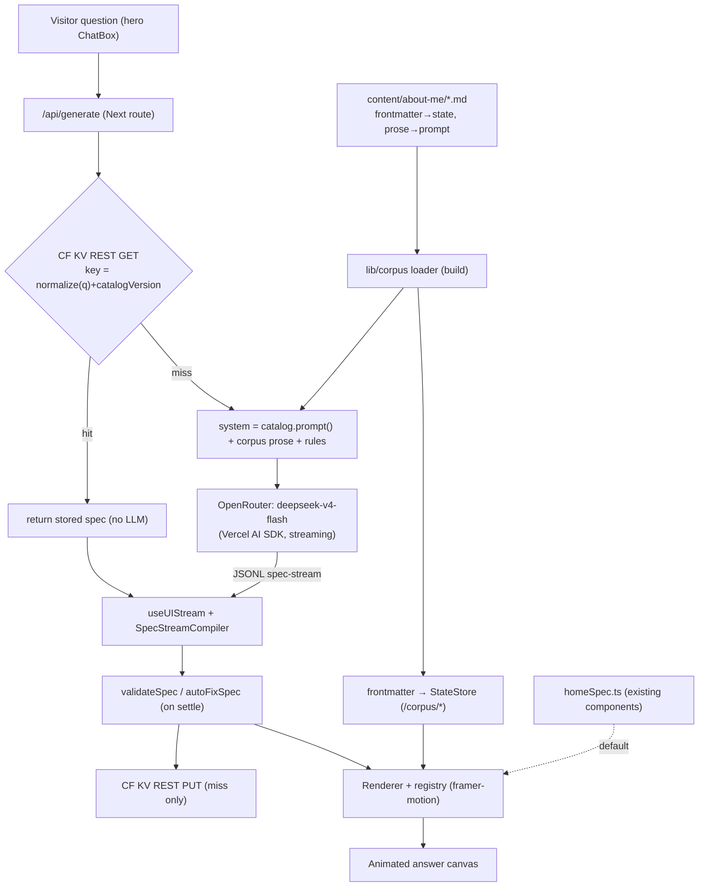

# Ask-Me Dynamic Portfolio — Design

**Date:** 2026-06-28
**Status:** Reviewed — review answers resolved; awaiting final go-ahead for `writing-plans`.
**Repo:** `OriginalByteMe` (app lives in `noah-portfolio/`)

---

## 1. Summary

Turn the portfolio into a site that **re-composes itself around a visitor's question**. A chat box lives permanently in the hero. When a visitor asks something ("What does Noah do for a living?", "How does the AI cutout tool work?"), an LLM reads a curated corpus about Noah and emits a [json-render](https://github.com/json-render) spec; the renderer streams that spec into the page body, animating a tailored answer built from a fixed catalog of Noah's own components. With no question, the site shows its normal default view (the **current page**, rendered through the same catalog). Repeat/similar questions are served from a cache to save API credits.

The dynamic site **is** the real site — not a separate widget. One renderer drives both the default view and every answer.

## 2. Goals / Non-goals

**Goals**
- A persistent hero chat box that drives the whole page.
- The body of the site restructures per question, composed from pre-built, animated components ("explain complex things simply").
- Answers are **grounded** in a corpus — the model arranges and narrates real facts, it does not invent them.
- The corpus is authored as **human-readable markdown docs** in the repo (a "knowledge base" precedent), not hardcoded data.
- A **cheap, fast, swappable open-weight model** via OpenRouter (no proprietary-frontier lock-in or cost).
- The default (no-question) view **reuses the existing components**, so it matches the current site (look, animations, shell).
- Shareable answers via `?q=` URLs.
- A cache so an already-asked question doesn't re-spend an LLM call.

**Non-goals (now)**
- Rate limiting / abuse infra (handled by graceful degradation; revisited only if a real bill/429 appears).
- Semantic/embedding question clustering (Phase 2 seam only).
- **Redesigning the current visuals** — we adapt and reuse existing component code, so the home view stays today's design.
- Charting/dashboard components and external-API knowledge sources (GitHub/LinkedIn/blog) — **planned, Phase 2+** (§6/§15).
- A bespoke per-question video reel (Phase 2: `ExplainerReel` via Remotion).

## 3. Locked decisions

| # | Decision | Choice | Why |
|---|---|---|---|
| 1 | Default vs dynamic | **One renderer, two specs.** Persistent React shell; body is a json-render canvas rendering either `homeSpec` (default) or a streamed answer spec. The default view **reuses the existing components** adapted into registry impls. | The dynamic site is the real site; LLM reuses every building block; "restructure" = swap spec; home view stays today's page. |
| 2 | Corpus model | **Markdown knowledge base, state-bound.** `content/about-me/*.md`: frontmatter = structured bindable records → `/corpus/*`; prose body = narrative knowledge → prompt. Model emits structure + `$state` bindings + connective prose. | Human-authored docs precedent; hard facts come from parsed data, not the model → near-zero fabrication; grounded. |
| 3 | Provider + model | **OpenRouter open-weight model** (default `deepseek/deepseek-v4-flash`) via **Vercel AI SDK** + `@openrouter/ai-sdk-provider`, `OPENROUTER_API_KEY`. **Progressive JSONL streaming.** | Cheap (~$0.09/$0.18 per M), fast (~100 t/s, prefix caching), structured-output-capable, 1M context, slug swappable in one line; streaming = the self-assembly "wow." |
| 4 | Animation | **framer-motion** core (enter/exit/layout, `AnimatePresence`, stagger). Keep Lottie + CSS blob background. | Purpose-built for orchestrated enter/exit/reflow; makes streaming look intentional. |
| 5 | Cache storage | **Cloudflare Workers KV via REST** from the Next API route. Key = `normalize(question) + catalogVersion`. | Free at this scale (100k reads / 1k writes per day, 1 GB); REST `PUT` is imperative, so streaming-on-miss survives. Matches user's stack. |
| 6 | Rate limiting | **De-scoped.** Graceful fallback on LLM error; trivial ~280-char input cap. | Only a concern at high traffic; fix when it actually arises. |
| 7 | Sharing / reset | `?q=` URL, auto-run on load; cache makes shares stable. Hero chat persists; "↺ home" restores `homeSpec`; new question cross-fades the canvas. | Immediate shareable links, zero extra infra. |

### Review answers (resolved)

- **Home view = one system, by adapting existing components.** Lift the current `Hero`/`About`/`Projects`/`Contact` JSX (and sub-pieces — project cards, skill categories, work history, frosted-glass, Spotify reveal) into the json-render **registry implementations**, refactored only to take data via props/`$state` instead of inline arrays. The home view is literally today's page rendered through the catalog. "Let's see what's possible first": Phase 1 step 3 includes a fidelity check; anything the catalog can't yet express 1:1 is kept as a registered React escape-hatch component rather than redesigned.
- **Catalog = the basic list in §6 for Phase 1.** Charting/dashboard + external-API sources are deferred (§6 note, §15).
- **Default model = `deepseek/deepseek-v4-flash`** (validated cheapest-fast open option; see §8). GLM-5.2 is the lowest-TTFT swap.
- **Corpus seed = the current hardcoded data**, extracted into `content/about-me/*.md`; augmented later (blog/LinkedIn ingestion — §15).

## 4. Architecture & data flow

The **shell** (lava-lamp background, theme provider/switch, header links, `SpeedInsights`, and the hero with avatar + `TypeAnimation` + `SpotifyReveal` + the new `ChatBox`) is plain React and never re-specced. Everything below the hero is a **single json-render canvas**.



Two specs flow through **one** `Renderer`: `homeSpec` (static default, built from the adapted existing components) and the streamed/cached answer spec. Structured facts live in the StateStore at `/corpus/*` (parsed from frontmatter); the model never emits raw facts, only structure + bindings + prose.

## 5. Module / file layout (`noah-portfolio/`)

**New — corpus (markdown knowledge base)**
- `content/about-me/*.md` — human-authored knowledge: e.g. `bio.md`, `career.md`, `skills.md`, `operating-systems.md`, `fun-facts.md`, `contact.md`, `projects/<slug>.md`. Each file: YAML **frontmatter** (structured bindable records) + markdown **body** (narrative prose). Seeded by extracting the current hardcoded arrays.
- `lib/corpus/types.ts` — typed shapes: `Bio`, `Job`, `Project`, `SkillCategory`, `OperatingSystem`, `Contact`, `FunFact`.
- `lib/corpus/loader.ts` — reads `content/about-me/**` at build, parses frontmatter (gray-matter) → typed structured corpus, collects prose bodies → `knowledge` string. Build-time load (bundles reliably on Vercel; no runtime fs).
- `lib/corpus/index.ts` — exposes `corpusState()` (structured → StateStore), `knowledge()` (prose → prompt), `corpusSnapshot()` (compact structured summary → prompt).

**New — json-render**
- `lib/jsonui/schema.ts` — re-export `@json-render/react/schema`.
- `lib/jsonui/catalog.ts` — `defineCatalog(schema, { components })` with zod prop schemas + descriptions.
- `lib/jsonui/registry.tsx` — `defineRegistry(catalog, { components })`; impls are the **adapted existing components** wrapped in framer-motion (see Adapted below).
- `lib/jsonui/homeSpec.ts` — hand-authored default spec composing the catalog into today's layout.
- `lib/jsonui/catalogVersion.ts` — `CATALOG_VERSION` string; bump on catalog/schema change to invalidate cache.

**New — pipeline / cache / UI**
- `lib/llm/openrouter.ts` — `createOpenRouter({ apiKey: env.OPENROUTER_API_KEY })`; exports the configured model (slug from env, default `deepseek/deepseek-v4-flash`); optional throughput-sorted provider routing.
- `lib/cache/kv.ts` — CF KV REST client (`get`, `put`) with scoped token from env.
- `lib/cache/key.ts` — `normalizeQuestion()` + `cacheKey()`.
- `app/api/generate/route.ts` — cache-read → stream-or-serve → cache-write.
- `components/ChatBox.tsx` — hero chat input.
- `components/PortfolioCanvas.tsx` — `<Renderer>` wrapped in `AnimatePresence`, fed by `usePortfolioCanvas`.
- `lib/hooks/usePortfolioCanvas.ts` — owns `mode` (`home | streaming | answer`), active spec, `?q=` sync, reset.

**Changed**
- `app/page.tsx` — `<LavaLampBackground/>`, `<Hero/>` (now with `ChatBox`), `<PortfolioCanvas/>`.
- `components/Hero.tsx` — add `ChatBox`; otherwise unchanged.
- `app/StoreProvider.tsx` / providers — mount json-render `StateProvider` (seeded with `corpusState()`), `ActionProvider`, `VisibilityProvider`.

**Adapted (reused, not rebuilt)** — to retain the current design exactly:
- `components/About.tsx`, `components/Projects.tsx`, `components/Contact.tsx` — their JSX/Tailwind/Lottie markup is **lifted into registry component impls** (`SkillGrid`/`SkillCloud`, `ProjectShowcase`, `CareerTimeline`, `ContactCard`, etc.), refactored to take data via props/`$state` instead of inline `skillCategories`/`workHistory`/`projects` arrays (those move to the corpus). Existing sub-components (`ui/frosted-glass-box`, `ui/spotify-reveal`, `ui/spotify-pill`) are reused inside the impls. Any piece the catalog can't yet express 1:1 stays as a registered escape-hatch component.

**New deps:** `@json-render/core`, `@json-render/react`, `framer-motion`, `ai`, `@openrouter/ai-sdk-provider`, `gray-matter`. (Phase 2: `@json-render/remotion`, `@remotion/player`, `remotion`.)
**New env:** `OPENROUTER_API_KEY`, `OPENROUTER_MODEL` (optional override), CF KV REST creds (`CF_ACCOUNT_ID`, `CF_KV_NAMESPACE_ID`, `CF_KV_TOKEN`).

## 6. The catalog

~15 components. Each = a typed `defineCatalog` entry (zod props + a description that teaches the model when to use it) and a framer-motion-animated React impl (mostly the adapted existing components). Fact-blocks read from `/corpus/*` via `$state`, so the model can only arrange/select real data.

| Component | Group | Purpose | Data |
|---|---|---|---|
| `Section`, `Stack`, `Columns`, `Grid` | Layout | Arrangement containers | — |
| `Prose`, `Heading`, `Callout`, `Quote` | Voice | Model-authored narrative/connective text | model text |
| `CareerTimeline` | Facts | Animated company/role progression (from `About` work history) | `/corpus/careerTimeline` |
| `ProjectShowcase` | Facts | Project hero: image, desc, tech, link (from `Projects`) | `/corpus/projects` |
| `SkillCloud` / `SkillGrid` | Facts | Categorized skills w/ icons (from `About`) | `/corpus/skills` |
| `StatCallout` | Facts | Big metric ("5+ years") | corpus or model |
| `ContactCard` | Facts | Links (GitHub, blog, email) (from `Contact`) | `/corpus/contact` |
| `LottieFigure` | Personality | Illustrative Lottie (`DotLottieReact`) | asset ref |
| `SpotifyNowPlaying` | Personality | Existing reveal | existing hook |
| `ImageBlock` | Personality | Image + caption | asset ref |
| `StepFlow` | Explainer | Animated numbered steps — "how X works" | model + corpus |
| `ExplainerReel` | **Phase 2 seam** | Mounts a Remotion `<Player>` for a per-question reel | timeline spec |

**Future catalog extensions (Phase 2+, deferred):** charting/dashboard components (e.g. `StatDashboard`, `Chart`) fed by **external-API data sources** — GitHub issue tracking/activity, LinkedIn, blog feed. These add new corpus *connectors* (live data) and chart components; out of Phase 1 to keep the basic catalog focused.

Component `description` fields are effectively prompt engineering and will be written deliberately.

## 7. The corpus (markdown knowledge base)

The single source of truth is a folder of human-authored markdown — readable docs that double as the AI's knowledge. Each file carries **frontmatter** (structured, bindable) and a **body** (narrative prose):

```markdown
---
# content/about-me/career.md
jobs:
  - company: "Acme"
    role: "Software Engineer"
    start: "2022"
    end: "present"
    highlights: ["Built X", "Scaled Y"]
---
I work mostly across backend and infra... (prose the model can quote/paraphrase)
```

The loader parses **all** frontmatter into the typed structured corpus (`careerTimeline`, `projects`, `skills`, `operatingSystems`, `contact`, `bio`, `funFacts`) loaded into a `createStateStore` at `/corpus/*`, and concatenates the **prose bodies** into a `knowledge` string injected into the system prompt. So:

- **Fact-blocks bind to parsed frontmatter** (`CareerTimeline` → `/corpus/careerTimeline`) — grounded, no hallucination.
- **The model writes narrative** informed by the prose knowledge — adapts the voice to the question.
- **`homeSpec` and answers consume the same `/corpus/*` paths** → zero data drift.

**Phase 1 seed:** extract the current hardcoded `skillCategories` / `workHistory` / `projects` / `operatingSystems` arrays into these files (frontmatter), plus a short authored bio/prose. **Later:** ingest from the blog (`blog.noahrijkaard.com`) and possibly LinkedIn as additional prose knowledge / connectors (§15).

Corpus state is kept in json-render's own `StateStore` (the existing Redux store stays Spotify-only; the `@json-render/redux` adapter remains an option for later unification, not used now). Loading is build-time to bundle reliably on Vercel.

## 8. Generation pipeline

`app/api/generate/route.ts`:
1. Read + validate input (≤280 chars).
2. `cacheKey = cacheKey(normalizeQuestion(q), CATALOG_VERSION)`; CF KV REST `GET`.
3. **Hit** → return stored spec as a single-shot stream chunk (uniform client path).
4. **Miss** → `system = catalog.prompt({ customRules })` + `knowledge()` (corpus prose) + rules (only bind to `/corpus/*`; off-topic → redirect layout); `user = buildUserPrompt({ prompt, state: corpusSnapshot() })`; call the OpenRouter model via Vercel AI SDK (`@openrouter/ai-sdk-provider`), stream JSONL spec patches.
5. Client: `useUIStream` + `createSpecStreamCompiler` assemble the live spec; components mount as patches arrive (self-assembly).
6. On settle: `validateSpec` → `autoFixSpec` (withhold lossy fixes until retries exhausted) guarantees a renderable final frame; on a miss, CF KV REST `PUT` the final spec.

**Model selection** (slug from `OPENROUTER_MODEL`, default below; one-line swap, `:floor` routes to cheapest provider; throughput varies up to ~25× by provider, so sort providers by throughput for speed). Benchmarks as of June 2026:

| Model | ~$/M (in/out) | Speed | Notes |
|---|---|---|---|
| `deepseek/deepseek-v4-flash` *(default)* | $0.09 / $0.18 | ~100 t/s, **prefix caching ~$0.0028/M** | MoE 284B/13B-active, **1M ctx**, structured output/JSON mode, MIT. Stable catalog+corpus prefix is nearly free via caching. |
| `glm-5.2` *(lowest-latency swap)* | ~budget | **fastest TTFT in open-weight class** | Native structured JSON + function calling; pick if first-paint latency dominates the streaming feel. (Confirm exact OpenRouter slug.) |
| `qwen/qwen3-30b-a3b` | $0.08 / $0.28 | fast (MoE) | Ultra-budget floor; strong JSON/instruction following. |
| `minimax/minimax-m3` | higher | — | Quality ceiling if specs get complex (frontier coding, 1M ctx). |

**TTFT vs throughput:** for a streamed self-assembly, time-to-first-token sets how fast the *first* component appears; throughput sets how fast the rest fill in. We default to V4 Flash (great balance + caching) and keep GLM-5.2 as the low-TTFT option — both swappable via `OPENROUTER_MODEL`.

Optional: enable the provider's **Response Healing** plugin as an extra malformed-JSON safety net alongside `autoFixSpec`.

## 9. Caching

- **Backend:** Cloudflare Workers KV via REST API (scoped token in env), called from the Next route. Free tier amply covers a portfolio (writes = unique new questions « 1k/day; reads « 100k/day; specs are KBs « 25 MB value cap).
- **Key:** `normalize(question) + ":" + CATALOG_VERSION`. Normalization: lowercase, trim, collapse internal whitespace.
- **Read-heavy:** repeat/similar questions hit the cache and skip the LLM — the primary cost lever.
- **Consistency:** KV is eventually consistent (~60s). Acceptable for a cache: two visitors asking the *same brand-new* question within ~60s may both trigger a generation. Harmless.
- **Invalidation:** because facts are `$state`-bound, cached specs hold *structure + bindings*, not raw facts — editing the corpus needs **no** cache flush (specs re-bind to fresh data at render time). Only catalog/schema changes invalidate, handled by bumping `CATALOG_VERSION` (changes the key → instant global miss, no flush).

## 10. Client orchestration

- `usePortfolioCanvas` owns `mode` (`home | streaming | answer`), the active spec, and `?q=` URL sync.
- `ChatBox` (hero) submits → sets `?q=` → triggers generation → streams into the canvas.
- `PortfolioCanvas` wraps `<Renderer>` in `AnimatePresence` keyed on spec identity → cross-fade home↔answer; `layout` handles reflow.
- "↺ home" control clears `?q=` and restores `homeSpec`.
- On initial load with `?q=` present, generation auto-runs (shareable links; cache makes them stable).

## 11. Error handling & guardrails

- **Catalog is a hard boundary** — unknown component types are pruned by `autoFixSpec`; the model physically can't render a fabricated fact-block.
- **Off-topic / hostile** → instructed redirect layout (about/home content + a polite note).
- **LLM error / quota (429) / invalid spec** → toast + fall back to `homeSpec`; never a blank page. (Response Healing + `autoFixSpec` reduce malformed-spec failures.)
- **Input cap** ~280 chars (input validation, not rate limiting).
- **No rate limiter** (de-scoped); cost scales linearly with unique questions, mitigated by the cache + a cheap model.

## 12. Phasing & build order

**Phase 1 — core (ships the whole vision)**
1. Corpus: author `content/about-me/*.md` (extract current hardcoded data into frontmatter + prose) + `lib/corpus` loader/types.
2. Catalog + registry — adapt existing `Hero`/`About`/`Projects`/`Contact` components into framer-motion registry impls (props/`$state`-driven).
3. `homeSpec` composing the catalog into today's layout + fidelity check vs current page (escape-hatch any gaps).
4. `StateProvider`/`ActionProvider`/`VisibilityProvider` wiring with corpus state.
5. `/api/generate` (prompt assembly + OpenRouter streaming, `deepseek-v4-flash`).
6. `ChatBox` + `PortfolioCanvas` + `usePortfolioCanvas` (streaming render, transitions, reset).
7. Graceful error/off-topic fallback.
8. CF KV cache (read/write) + `?q=` sharing.

**Phase 2 — enhancements**
- Charting/dashboard catalog components + external-API connectors (GitHub issues/activity, LinkedIn, blog feed).
- `ExplainerReel`: second (timeline) schema/catalog/prompt via `@json-render/remotion` + `@remotion/player`; model emits a reel spec for "how does X work" questions, rendered live in-browser. (Licensing: Remotion is free for individuals — confirm before building.)
- Semantic cache: embedding-similarity keying so near-duplicate questions share an entry (replaces exact-normalized keying; renderer untouched).

## 13. Testing strategy

- **Unit:** catalog zod prop schemas accept/reject; `validateSpec`/`autoFixSpec` on crafted-malformed specs; cache key normalization; corpus loader (frontmatter → typed state, prose → knowledge); corpus typing.
- **Renderer:** each registry component renders + binds a `/corpus/*` value (React Testing Library); home-view fidelity smoke check.
- **Pipeline (model mocked):** feed a recorded JSONL stream → assert the compiler builds the expected spec and the canvas mounts the right components; assert cache hit path returns the stored spec without an LLM call. No live-LLM tests in CI.
- **E2E (Playwright):** type a question → canvas transitions → `?q=` populates → reload reproduces; "↺ home" restores default; forced LLM error falls back to `homeSpec`.

## 14. Resolved in review

1. **One-system home view** by adapting/reusing existing components (not rebuilding) — confirmed.
2. **Catalog** = basic §6 list for Phase 1; charting/dashboard + external APIs deferred — confirmed.
3. **Default model** `deepseek/deepseek-v4-flash` (GLM-5.2 low-TTFT swap) — confirmed pending final nod.
4. **Corpus seed** = current hardcoded data → markdown; blog/LinkedIn ingestion later — confirmed.

Remaining nit: confirm the exact OpenRouter slug for GLM-5.2 if/when we want to try it (default V4 Flash needs no further input).

## 15. Out of scope / future

- Rate limiting (until a real bill/429 appears).
- Charting/dashboard + external-API knowledge connectors (GitHub/LinkedIn/blog) — Phase 2+.
- Semantic question clustering (Phase 2).
- Remotion `ExplainerReel` (Phase 2).
- Multi-turn conversation (each question is currently independent).
- Analytics on asked questions (would favor D1 over KV if pursued).
